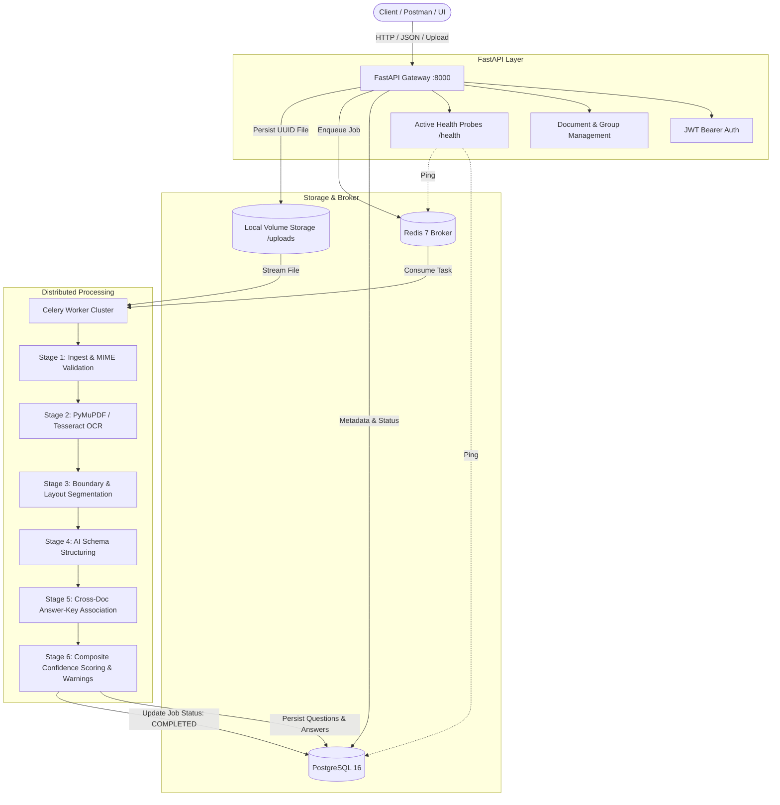

# 📄 Exam Document Parser & Question Extraction Service

[](https://www.python.org/)
[](https://fastapi.tiangolo.com/)
[](https://www.postgresql.org/)
[](https://redis.io/)
[](https://docs.celeryq.dev/)
[](https://www.docker.com/)
[](LICENSE)

An asynchronous, distributed backend service built with **FastAPI**, **PostgreSQL**, **Redis**, and **Celery** designed to ingest complex exam papers, question banks, and answer keys (digital PDFs, scanned documents, and images). It segments multi-page questions, extracts structured schemas via an AI/LLM pipeline, resolves answer keys across standalone or linked documents, and calculates mathematical composite confidence scores.

---

## 🌟 Key Features

* **⚡ Dual-Path Text Extraction**:
  * **Digital Path**: Ultra-fast text layer parsing via **PyMuPDF (`fitz`)** (milliseconds per page).
  * **Scanned/Image Fallback**: Automatic image pre-processing and OCR extraction via **Tesseract OCR** for scanned PDFs and images (PNG, JPEG).
* **🧩 Multi-Page Question Segmentation**:
  * Handles questions spanning across page boundaries (e.g. question statement on Page $N$, options on Page $N+1$).
  * Records participating page indices in `source_pages: int[]`.
* **🤖 Pluggable AI Structuring**:
  * Structures raw text into machine-readable JSON: question text, options ($A, B, C, D$), question type (MCQ, true/false, open-ended), and subject tags.
  * Defensive JSON-schema validation with automated retry prompts and graceful degradation to `needs_review` on failure.
  * Pluggable provider architecture: `mock` (deterministic local tests without keys), `openai` (GPT-4o-mini), and `gemini`.
* **🔗 Cross-Document Answer-Key Resolution**:
  * Supports answer keys embedded inside the same document or linked across separate documents via **Document Groups** (e.g. `exam.pdf` + `solutions.pdf`).
  * Two-tier matching logic: exact `number_match` with automatic fallback to semantic/content similarity matching.
  * Strict anti-hallucination guarantee: marks unmatched questions as `unmatched` with `confidence: 0.0` rather than fabricating answers.
* **📊 Two-Phase Composite Confidence Model**:
  * Combines upstream OCR quality, AI extraction self-reported scores, and answer matching certainty.
  * Categorizes results into `extracted` ($\ge 0.75$), `partial` ($0.40 - 0.74$), or `needs_review` ($< 0.40$).
* **🛡️ Production-Grade Isolation & Fault Tolerance**:
  * Non-blocking `ProcessingWarning` system records degraded pages without crashing Celery workers.
  * Strict multi-tenant data isolation: documents, groups, and questions are bounded by `owner_user_id` via JWT Bearer authentication.

---

## 🏗️ Architecture & Pipeline Flow



---

## 🚀 Quickstart Guide (Docker Compose)

### 1. Prerequisites
- [Docker Engine](https://docs.docker.com/engine/install/) (v24.0+)
- [Docker Compose](https://docs.docker.com/compose/) (v2.20+)
- Available Ports: `8000` (FastAPI), `5432` (PostgreSQL), `6379` (Redis)

### 2. Clone & Environment Configuration
```bash
git clone https://github.com/OmGupta03/Exam-document-parser.git
cd Exam-document-parser

# Copy environment template
cp .env.example .env
```

*(Optional)* To use live OpenAI structuring, add your key to `.env`:
```ini
AI_PROVIDER=openai
OPENAI_API_KEY=sk-your-openai-api-key
LLM_MODEL=gpt-4o-mini
```
*(By default, `AI_PROVIDER=mock` allows full local execution and testing without any third-party API keys).*

### 3. Build and Start Services
```bash
docker-compose up -d --build
```
This initializes 4 containerized services:
1. `pbnc_postgres`: PostgreSQL 16 database with health check.
2. `pbnc_redis`: Redis 7 task broker & result backend.
3. `pbnc_api`: FastAPI application server (Uvicorn).
4. `pbnc_worker`: Celery worker with PyMuPDF, Tesseract, and OpenCV installed.

### 4. Verify System Health
```bash
curl -s http://localhost:8000/health
```
**Expected Response (HTTP 200):**
```json
{
  "status": "healthy",
  "database": "connected",
  "redis": "connected",
  "version": "1.0.1"
}
```

---

## 📡 API Reference & Core Workflows

Interactive API docs are live out of the box:
- **Swagger UI**: [http://localhost:8000/docs](http://localhost:8000/docs)
- **ReDoc**: [http://localhost:8000/redoc](http://localhost:8000/redoc)
- **Postman Collection**: Import [`postman_collection.json`](postman_collection.json) directly into Postman.

### 1. Authentication

#### Register a user:
```bash
curl -X POST http://localhost:8000/api/v1/auth/register \
  -H "Content-Type: application/json" \
  -d '{
    "email": "user@example.com",
    "password": "Password123!"
  }'
```

#### Login & Acquire JWT Token:
```bash
curl -X POST http://localhost:8000/api/v1/auth/login/json \
  -H "Content-Type: application/json" \
  -d '{
    "email": "user@example.com",
    "password": "Password123!"
  }'
```
*Save the `access_token` from the response to include as `Authorization: Bearer <TOKEN>` on all subsequent calls.*

---

### 2. Document Ingestion & Processing

#### Upload an Exam Document:
```bash
curl -X POST http://localhost:8000/api/v1/documents/upload \
  -H "Authorization: Bearer <TOKEN>" \
  -F "file=@samples/inputs/digital_exam.pdf"
```

#### Check Extraction Status:
```bash
curl -X GET http://localhost:8000/api/v1/documents/{document_id} \
  -H "Authorization: Bearer <TOKEN>"
```
*Lifecycle stages:* `QUEUED` ➔ `PROCESSING` ➔ `COMPLETED` (or `COMPLETED_WITH_WARNINGS` / `FAILED`).

#### Retrieve Structured Questions:
```bash
curl -X GET http://localhost:8000/api/v1/documents/{document_id}/questions \
  -H "Authorization: Bearer <TOKEN>"
```

**Example Output:**
```json
{
  "document_id": "8fa53856-1234-4a56-b789-0123456789ab",
  "total_questions": 5,
  "questions": [
    {
      "id": "e6a12f9b-648b-4b10-a249-1667b93a0279",
      "question_number": "1",
      "question_text": "What is the primary function of mitochondria in eukaryotic cells?",
      "question_type": "multiple_choice",
      "options": {
        "A": "Photosynthesis",
        "B": "ATP production via cellular respiration",
        "C": "Protein synthesis",
        "D": "Lipid storage"
      },
      "source_pages": [1],
      "confidence_score": 0.98,
      "status": "extracted",
      "answer": {
        "answer_text": "B",
        "explanation": "Mitochondria generate most of the cell's chemical energy.",
        "source_page": 3,
        "match_method": "number_match",
        "confidence": 0.95
      }
    }
  ]
}
```

---

### 3. Linking Question Papers & Answer Keys (Document Groups)

When questions and solutions reside in separate files:

1. **Create a Document Group**:
   ```bash
   curl -X POST http://localhost:8000/api/v1/document-groups \
     -H "Authorization: Bearer <TOKEN>" \
     -H "Content-Type: application/json" \
     -d '{"name": "Biology Midterm 2026"}'
   ```
2. **Attach Uploaded Documents**:
   ```bash
   curl -X POST http://localhost:8000/api/v1/document-groups/{group_id}/documents/{question_doc_id} \
     -H "Authorization: Bearer <TOKEN>"
   
   curl -X POST http://localhost:8000/api/v1/document-groups/{group_id}/documents/{answer_key_doc_id} \
     -H "Authorization: Bearer <TOKEN>"
   ```
3. The background worker cross-references the answer keys with the question paper, applying number and semantic content matching.

---

## 📐 Composite Confidence Scoring Model

The pipeline computes question confidence in an explicit **two-phase lifecycle**:

### Phase 1: Question Extraction Quality (Stage 4)
$$\text{question\_conf} = \text{round}\Big((\text{ocr\_confidence} \times 0.40) + (\text{llm\_self\_reported\_confidence} \times 0.60),\, 2\Big)$$

### Phase 2: In-Place Answer Integration (Stage 6)
- **With Answer Key Associated**:
  $$\text{final\_confidence} = \text{round}\Big((\text{question\_conf} \times 0.80) + (\text{answer\_match\_confidence} \times 0.20),\, 2\Big)$$
  *Where `answer_match_confidence` is `0.95` for exact number match, `0.70` for content match, and `0.00` for unmatched.*
- **Standalone Question Paper**:
  $$\text{final\_confidence} = \text{question\_conf}$$

### Status Classification:
| Status | Threshold | Description |
| :--- | :--- | :--- |
| `extracted` | $\ge 0.75$ | High-fidelity extraction, complete structure and valid options. |
| `partial` | $0.40 - 0.74$ | Legible text, minor structural defects, or missing option keys. |
| `needs_review` | $< 0.40$ | Low OCR clarity, schema validation failure, or ambiguous formatting. |

---

## 🧪 Testing & Validation

The codebase includes comprehensive unit, API integration, and provider isolation test suites.

### Run Tests inside Docker:
```bash
docker-compose exec api pytest -v tests/test_unit.py tests/test_api.py tests/test_openai_provider.py
```

### Run Multi-Document End-to-End Verification:
```bash
# Verify question paper and answer key linking
docker-compose exec api python tests/run_final_demonstration.py

# Verify non-fabrication and content matching on unnumbered exams
docker-compose exec api python tests/verify_content_match.py

# Verify corrupted page failure isolation
docker-compose exec api python tests/verify_failure_isolation.py
```

---

## 📁 Repository Structure

```
├── alembic/                  # Database migration definitions & revisions
│   └── versions/             # Auto-applied schema migrations
├── app/
│   ├── api/                  # FastAPI routers and dependency injection
│   │   ├── deps.py           # User authentication & DB session resolution
│   │   └── v1/endpoints/     # Documents, Groups, Questions, Warnings, Auth
│   ├── core/                 # App configuration (Pydantic Settings), Security
│   ├── db/                   # Async & Sync SQLAlchemy database engines
│   ├── models/               # SQLAlchemy ORM database models
│   ├── schemas/              # Pydantic schemas (request/response contracts)
│   ├── services/             # Pipeline business logic
│   │   ├── ai_provider.py    # Mock, OpenAI, & Gemini extraction adapters
│   │   ├── answer_key.py     # Number & content similarity answer matcher
│   │   ├── segmentation.py   # Multi-page layout & question segmenter
│   │   └── text_extraction.py# PyMuPDF fast path & Tesseract OCR engine
│   ├── workers/              # Celery task definitions & pipeline stages
│   └── main.py               # FastAPI entrypoint & lifecycle handlers
├── samples/                  # Sample test inputs & exported JSON schemas
│   ├── inputs/               # Scanned, digital, multi-page & corrupted PDFs/images
│   └── outputs/              # Example parsed outputs with confidence scores
├── tests/                    # Automated unit, integration, and security tests
├── ARCHITECTURE.md           # In-depth architectural trade-offs & design choices
├── PRD.md                    # Product Requirements Document
├── SETUP.md                  # Deployment, migrations, & configuration manual
├── docker-compose.yml        # Multi-container service definitions
├── Dockerfile                # Multi-stage Python 3.11 build with Tesseract
└── requirements.txt          # Python package dependencies
```

---

## 📄 License

Distributed under the MIT License. See [LICENSE](LICENSE) for more details.
